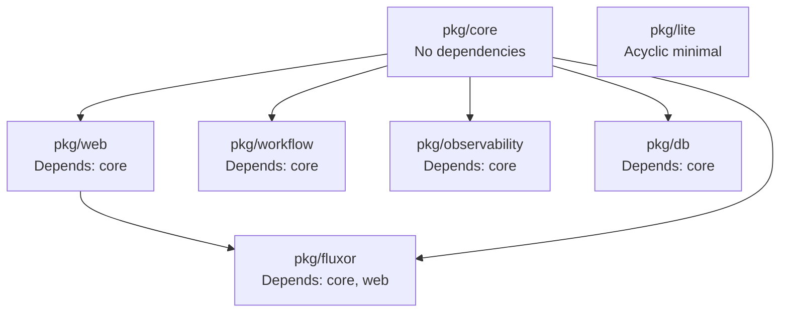

# Fluxor Package Organization: "Pkg Sạch" Principles

## Tổng quan

Fluxor tuân thủ **Go best practices** cho package organization, tạo ra một cấu trúc "pkg sạch" - modular, maintainable, và enterprise-grade.

## Cấu trúc pkg/

```
pkg/
├── core/              # Lõi framework - không phụ thuộc package khác
│   ├── verticle.go
│   ├── eventbus.go
│   ├── context.go
│   └── concurrency/  # Sub-packages cho domain cụ thể
│
├── web/               # HTTP layer - phụ thuộc core
│   ├── server.go
│   ├── router.go
│   └── middleware/   # Sub-packages cho middleware
│
├── workflow/          # Workflow engine - phụ thuộc core
│   ├── engine.go
│   ├── nodes.go
│   └── types.go
│
├── observability/     # Metrics, tracing - phụ thuộc core
│   ├── prometheus/
│   └── otel/
│
├── db/                # Database - phụ thuộc core
│   └── pool.go
│
├── fluxor/            # High-level runtime - phụ thuộc core, web
│   └── main_verticle.go
│
└── lite/              # Minimal variant - acyclic dependencies
    ├── core/
    ├── web/
    └── fluxor/
```

## Nguyên tắc tổ chức

### 1. **Single Responsibility Principle**

Mỗi package có **một trách nhiệm duy nhất**:

- `pkg/core` → Runtime, EventBus, Verticles (foundation)
- `pkg/web` → HTTP server, routing, middleware
- `pkg/workflow` → Workflow orchestration
- `pkg/observability` → Metrics, tracing, logging
- `pkg/db` → Database connection pooling

**Ví dụ:**
```go
// pkg/core - chỉ chứa runtime primitives
package core

type EventBus interface {
    Publish(address string, body interface{}) error
    Send(address string, body interface{}) error
}

// pkg/web - chỉ chứa HTTP abstractions
package web

type Server interface {
    Start() error
    Stop() error
}
```

### 2. **Dependency Direction (Acyclic)**

Dependencies chỉ đi **một chiều**, không có circular dependencies:

```
core (no dependencies)
  ↑
web (depends on core)
  ↑
fluxor (depends on core, web)
```

**Kiểm tra cyclic dependencies:**
```bash
# CI check
go list -json ./... | jq -r '.Deps[]' | sort | uniq
```

### 3. **Interface-First Design**

Mỗi package export **interfaces rõ ràng**, implementation ẩn:

```go
// pkg/core/eventbus.go
package core

// Public interface
type EventBus interface {
    Publish(address string, body interface{}) error
    Consumer(address string) Consumer
}

// Implementation (internal)
type eventBus struct {
    // ...
}
```

**Lợi ích:**
- Dễ test (mock interfaces)
- Dễ swap implementation
- Clear contracts

### 4. **Sub-packages cho Domain Logic**

Khi package lớn, tách thành sub-packages:

```
pkg/web/
├── server.go          # Main types
├── router.go
└── middleware/        # Sub-package
    ├── auth/
    │   ├── jwt.go
    │   └── rbac.go
    └── security/
        ├── cors.go
        └── rate_limit.go
```

**Quy tắc:**
- Sub-package khi có >5 files cùng domain
- Sub-package khi cần isolate dependencies
- Sub-package khi có clear boundary

### 5. **Base Classes Pattern**

Sử dụng **embedding** để tái sử dụng code (Java-style base classes):

```go
// pkg/core/base_verticle.go
package core

type BaseVerticle struct {
    name string
    // common fields
}

// pkg/web/verticle.go
package web

type HttpVerticle struct {
    *core.BaseVerticle  // Embed base
    server *http.Server
}
```

**Lợi ích:**
- Giảm boilerplate
- Consistent patterns
- Easy to extend

### 6. **Example Code trong Doc Comments**

Mỗi public API có **example usage**:

```go
// Publish publishes a message to all handlers registered for the address.
//
// Example:
//   err := eventBus.Publish("user.created", map[string]interface{}{
//       "userId": 123,
//       "name": "John",
//   })
func (eb *eventBus) Publish(address string, body interface{}) error {
    // ...
}
```

### 7. **Test Files cùng Package**

Tests nằm cùng package để test internal implementation:

```
pkg/core/
├── eventbus.go
├── eventbus_test.go      # Same package
└── eventbus_impl.go      # Internal implementation
```

**Lợi ích:**
- Test internal logic
- Test edge cases
- Faster test execution

### 8. **README cho Complex Packages**

Packages phức tạp có README.md:

```
pkg/workflow/
├── README.md          # Usage guide
├── engine.go
└── nodes.go
```

## Dependency Graph



## Best Practices

### ✅ DO

1. **Export interfaces, not implementations**
   ```go
   // Good
   type EventBus interface { ... }
   
   // Bad
   type EventBus struct { ... }  // Export struct
   ```

2. **Use sub-packages for domains**
   ```go
   pkg/web/middleware/auth/  // Clear domain boundary
   ```

3. **Keep packages focused**
   ```go
   // Good: Single responsibility
   pkg/db/pool.go  // Only database pooling
   
   // Bad: Multiple responsibilities
   pkg/db/pool_and_cache.go  // Mixing concerns
   ```

4. **Document public APIs**
   ```go
   // Publish sends a message to all subscribers.
   // Returns error if address is invalid.
   func Publish(...) error
   ```

### ❌ DON'T

1. **Circular dependencies**
   ```go
   // Bad: pkg/web imports pkg/fluxor, pkg/fluxor imports pkg/web
   ```

2. **Export implementation details**
   ```go
   // Bad
   type eventBus struct {  // Should be unexported
       consumers map[string][]*consumer
   }
   ```

3. **God packages**
   ```go
   // Bad: Everything in one package
   pkg/fluxor/
       eventbus.go
       http.go
       workflow.go
       db.go
   ```

4. **Import cycles**
   ```go
   // Bad
   pkg/a imports pkg/b
   pkg/b imports pkg/a
   ```

## Package Size Guidelines

| Package | LOC | Files | Status |
|---------|-----|-------|--------|
| `pkg/core` | ~3000 | ~30 | ✅ Good |
| `pkg/web` | ~2000 | ~20 | ✅ Good |
| `pkg/workflow` | ~1500 | ~15 | ✅ Good |
| `pkg/observability` | ~800 | ~10 | ✅ Good |

**Quy tắc:**
- < 500 LOC: Single file OK
- 500-2000 LOC: Multiple files, same package
- > 2000 LOC: Consider sub-packages

## Testing Strategy

### Unit Tests
- Same package as implementation
- Test internal logic
- Fast execution

### Integration Tests
- Separate `*_integration_test.go` files
- Test cross-package interactions
- May use `test` build tag

### Example Tests
- `*_example_test.go` files
- Run as documentation
- Verify examples compile

## CI Checks

Fluxor CI đảm bảo:

1. **No circular dependencies**
   ```bash
   go list -json ./pkg/... | check-cycles
   ```

2. **All packages compile**
   ```bash
   go build ./pkg/...
   ```

3. **All tests pass**
   ```bash
   go test ./pkg/...
   ```

4. **No unused exports**
   ```bash
   staticcheck -checks U1000 ./pkg/...
   ```

## So sánh với các Framework khác

| Framework | Package Organization | Cyclic Deps | Interface-First |
|-----------|---------------------|-------------|-----------------|
| **Fluxor** | ✅ Modular, clear | ✅ None | ✅ Yes |
| Vert.x (Java) | ✅ Good | ⚠️ Some | ✅ Yes |
| Spring Boot | ✅ Good | ⚠️ Some | ✅ Yes |
| Most Go libs | ⚠️ Mixed | ⚠️ Some | ⚠️ Mixed |

## Kết luận

Fluxor's "pkg sạch" đạt được nhờ:

1. ✅ **Clear boundaries** - Mỗi package có trách nhiệm rõ ràng
2. ✅ **Acyclic dependencies** - Không có circular imports
3. ✅ **Interface-first** - Export interfaces, hide implementations
4. ✅ **Sub-packages** - Tổ chức domain logic rõ ràng
5. ✅ **Documentation** - Example code và README
6. ✅ **CI enforcement** - Automated checks

Đây là **best practice** cho Go frameworks, giống như:
- Uber's Go style guide
- Google's Go best practices
- Standard library organization

**Kết quả:** Code dễ maintain, dễ contribute, dễ fork một phần, và trông rất enterprise-grade.

