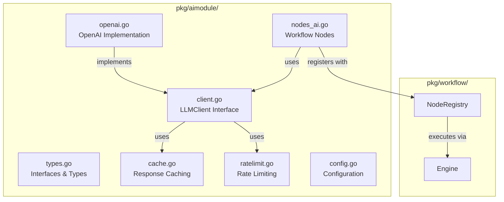

# AI Module Implementation Plan

## Overview

Tạo `pkg/aimodule/` - một AI module production-ready với multi-provider support, tool calling, caching, rate limiting, và workflow integration.

## Architecture



## Files Created

### 1. Core Types & Interfaces
**File**: `pkg/aimodule/types.go`

- `Provider` enum (OpenAI, Anthropic, Ollama, Grok, Gemini, Custom)
- `LLMClient` interface với methods: `Chat()`, `Embed()`, `Provider()`
- `ChatRequest`, `ChatResponse`, `Message`, `Tool`, `ToolCall` structs
- `EmbedRequest`, `EmbedResponse` structs
- `Config`, `RateLimitConfig`, `CacheConfig` structs

### 2. Client Interface
**File**: `pkg/aimodule/client.go`

- Base `LLMClient` interface implementation
- Client factory function `NewClient(config Config) (LLMClient, error)`
- Provider registry để map provider -> implementation
- Environment variable support

### 3. OpenAI Implementation
**File**: `pkg/aimodule/openai.go`

- `OpenAIClient` struct implements `LLMClient`
- Sử dụng `github.com/sashabaranov/go-openai` SDK
- Support chat completions với tool calling
- Support embeddings
- Error handling và retry logic với exponential backoff
- Timeout management

### 4. Caching
**File**: `pkg/aimodule/cache.go`

- In-memory cache với TTL
- Cache key từ request hash
- Thread-safe implementation
- Automatic cleanup goroutine
- Optional: Redis cache interface (để extend sau)

### 5. Rate Limiting
**File**: `pkg/aimodule/ratelimit.go`

- Token bucket rate limiter
- Support requests per minute/day
- Per-provider rate limits
- Thread-safe
- Automatic token reset

### 6. Workflow Nodes
**File**: `pkg/aimodule/nodes_ai.go`

- `AIChatNodeHandler` - Chat completion node
- `AIEmbedNodeHandler` - Embedding node  
- Template rendering support (`{{ $.input.field }}`)
- Integration với workflow `NodeInput`/`NodeOutput`
- Tool calling support

### 7. Configuration
**File**: `pkg/aimodule/config.go`

- `Init()` function để initialize default clients
- `DefaultClient()` để get default OpenAI client
- Environment variable support (API keys)
- Config loading từ FluxorContext

### 8. Node Registration
**File**: `pkg/workflow/nodes_aimodule.go`

- Adapter functions to convert between workflow and aimodule types
- `AIChatNodeHandler` - Wrapper for aimodule chat handler
- `AIEmbedNodeHandler` - Wrapper for aimodule embed handler
- Registered in `pkg/workflow/verticle.go` as:
  - `aimodule.chat`
  - `aimodule.embed`
  - `aimodule.toolcall`

### 9. Tests
**Files**: 
- `pkg/aimodule/cache_test.go` - Cache functionality tests
- `pkg/aimodule/ratelimit_test.go` - Rate limiter tests

### 10. Example Workflow
**Files**: `examples/aimodule-workflow/`
- `main.go` - Example workflow với AI chat node
- `workflow-tool-calling.json` - Example với tool calling
- `workflow-embedding.json` - Example với embedding

### 11. Documentation
**File**: `pkg/aimodule/README.md`
- Usage guide
- Configuration options
- Workflow node documentation
- Examples

## Implementation Details

### OpenAI Client (`openai.go`)

```go
type OpenAIClient struct {
    client  *openai.Client
    config  Config
    cache   *Cache
    limiter *RateLimiter
}

func (c *OpenAIClient) Chat(ctx context.Context, req ChatRequest) (*ChatResponse, error) {
    // 1. Check rate limit
    // 2. Check cache
    // 3. Call OpenAI API
    // 4. Cache response
    // 5. Return result
}
```

### Workflow Node Handler (`nodes_ai.go`)

```go
func AIChatNodeHandler(ctx context.Context, input *NodeInput) (*NodeOutput, error) {
    // 1. Get client from config or default
    // 2. Render prompt template
    // 3. Build ChatRequest
    // 4. Call client.Chat()
    // 5. Return NodeOutput với response
}
```

### Tool Calling Support

- Parse tools từ node config
- Execute tool calls
- Return results back to LLM
- Support multi-turn tool calling
- Tool choice configuration ("auto", "none", or specific function)

## Integration Points

1. **Workflow Verticle**: Updated `pkg/workflow/verticle.go` to register AI module nodes
   ```go
   v.engine.RegisterNodeHandler(NodeType("aimodule.chat"), AIChatNodeHandler)
   v.engine.RegisterNodeHandler(NodeType("aimodule.embed"), AIEmbedNodeHandler)
   v.engine.RegisterNodeHandler(NodeType("aimodule.toolcall"), AIChatNodeHandler)
   ```

2. **Engine Registry**: Added `Registry()` method to `pkg/workflow/engine.go` to expose registry

3. **Type Adapters**: Created `pkg/workflow/nodes_aimodule.go` to convert between workflow and aimodule types (avoids import cycle)

4. **Dependencies**: Added `github.com/sashabaranov/go-openai v1.41.2` to `go.mod`

## Example Workflow JSON

### Basic Chat Workflow

```json
{
  "id": "customer-support-ai",
  "nodes": [
    {
      "id": "trigger",
      "type": "webhook"
    },
    {
      "id": "ai-chat",
      "type": "aimodule.chat",
      "config": {
        "provider": "openai",
        "model": "gpt-4o",
        "prompt": "Bạn là trợ lý hỗ trợ khách hàng MoMo. Trả lời thân thiện bằng tiếng Việt: {{ $.input.query }}",
        "temperature": 0.7,
        "maxTokens": 500
      },
      "next": ["output"]
    },
    {
      "id": "output",
      "type": "respond"
    }
  ]
}
```

### Tool Calling Workflow

```json
{
  "id": "ai-tool-calling-example",
  "nodes": [
    {
      "id": "trigger",
      "type": "webhook"
    },
    {
      "id": "ai-with-tools",
      "type": "aimodule.chat",
      "config": {
        "provider": "openai",
        "model": "gpt-4o",
        "messages": [
          {
            "role": "system",
            "content": "You are a helpful assistant. Use tools when needed."
          },
          {
            "role": "user",
            "content": "{{ $.input.query }}"
          }
        ],
        "temperature": 0.7,
        "tools": [
          {
            "type": "function",
            "function": {
              "name": "get_weather",
              "description": "Get the current weather for a location",
              "parameters": {
                "type": "object",
                "properties": {
                  "location": {
                    "type": "string",
                    "description": "The city and state, e.g. San Francisco, CA"
                  }
                },
                "required": ["location"]
              }
            }
          }
        ],
        "toolChoice": "auto"
      },
      "next": ["output"]
    }
  ]
}
```

### Embedding Workflow

```json
{
  "id": "ai-embedding-example",
  "nodes": [
    {
      "id": "trigger",
      "type": "webhook"
    },
    {
      "id": "create-embeddings",
      "type": "aimodule.embed",
      "config": {
        "provider": "openai",
        "model": "text-embedding-ada-002",
        "input": ["{{ $.input.text }}"],
        "outputField": "embeddings"
      },
      "next": ["output"]
    }
  ]
}
```

## Configuration Options

### Client Config

```go
type Config struct {
    Provider     Provider         // "openai", "anthropic", "ollama", etc.
    APIKey       string           // API key (or use env var)
    BaseURL      string           // Base URL (optional, provider-specific defaults)
    DefaultModel string           // Default model
    Timeout      time.Duration   // Request timeout (default: 60s)
    MaxRetries   int             // Max retry attempts (default: 3)
    RateLimit    *RateLimitConfig // Rate limiting config
    Cache        *CacheConfig    // Response caching config
}
```

### Rate Limit Config

```go
type RateLimitConfig struct {
    RequestsPerMinute int // Per-minute limit
    RequestsPerDay    int // Per-day limit
}
```

### Cache Config

```go
type CacheConfig struct {
    Enabled bool          // Enable caching
    TTL     time.Duration // Time-to-live (default: 5 minutes)
}
```

## Environment Variables

- `OPENAI_API_KEY` - OpenAI API key
- `ANTHROPIC_API_KEY` - Anthropic API key
- `GROK_API_KEY` - Grok API key
- `GEMINI_API_KEY` - Gemini API key
- `CURSOR_API_KEY` - Cursor API key

## Testing Strategy

1. Unit tests cho OpenAI client (với mock)
2. Integration tests cho workflow nodes
3. Example workflows để verify end-to-end
4. Cache tests - verify TTL and expiration
5. Rate limiter tests - verify limits and reset

## Key Design Decisions

### Import Cycle Avoidance

- Created separate `NodeInput` and `NodeOutput` types in `aimodule` package
- Used adapter functions in `pkg/workflow/nodes_aimodule.go` to convert types
- Avoids circular dependency between `pkg/aimodule` and `pkg/workflow`

### Provider Registry Pattern

- Factory pattern for creating clients
- Easy to add new providers by implementing `LLMClient` interface
- Register with `RegisterClientFactory()`

### Caching Strategy

- In-memory cache with hash-based keys
- TTL-based expiration
- Automatic cleanup goroutine
- Thread-safe implementation

### Rate Limiting Strategy

- Token bucket algorithm
- Separate limits for minute and day
- Automatic reset based on time windows
- Thread-safe

## Future Enhancements (Out of Scope)

- Ollama local support
- Anthropic client implementation
- Vector search integration
- Redis cache backend
- Metrics và observability
- Streaming support
- Vision API support
- Audio API support

## Usage Examples

### Programmatic Usage

```go
import (
    "context"
    "github.com/fluxorio/fluxor/pkg/aimodule"
)

// Create client
config := aimodule.Config{
    Provider:     aimodule.ProviderOpenAI,
    APIKey:       "your-key", // or use OPENAI_API_KEY env var
    DefaultModel: "gpt-4o",
    Timeout:      60 * time.Second,
    MaxRetries:   3,
    Cache: &aimodule.CacheConfig{
        Enabled: true,
        TTL:     5 * time.Minute,
    },
    RateLimit: &aimodule.RateLimitConfig{
        RequestsPerMinute: 60,
        RequestsPerDay:    10000,
    },
}

client, err := aimodule.NewClient(config)
if err != nil {
    log.Fatal(err)
}

// Chat completion
req := aimodule.ChatRequest{
    Model: "gpt-4o",
    Messages: []aimodule.Message{
        {Role: "system", Content: "You are a helpful assistant."},
        {Role: "user", Content: "Hello, world!"},
    },
    Temperature: 0.7,
    MaxTokens:   500,
}

resp, err := client.Chat(context.Background(), req)
if err != nil {
    log.Fatal(err)
}

fmt.Println(resp.Choices[0].Message.Content)
```

### Workflow Usage

```go
// In workflow verticle
workflowVerticle := workflow.NewWorkflowVerticle(&workflow.WorkflowVerticleConfig{
    HTTPAddr: ":8081",
})

// Workflow will automatically have access to:
// - aimodule.chat
// - aimodule.embed
// - aimodule.toolcall
```

## Implementation Status

✅ **Completed:**
- Core types and interfaces
- OpenAI client implementation
- Caching system
- Rate limiting
- Workflow node handlers
- Configuration management
- Node registration
- Basic tests
- Example workflows
- Documentation

⏳ **Future:**
- Additional provider implementations (Anthropic, Ollama, etc.)
- Redis cache backend
- Streaming support
- Enhanced observability

## Notes

- All code compiles successfully
- No import cycles
- Thread-safe implementations
- Production-ready error handling
- Comprehensive documentation

